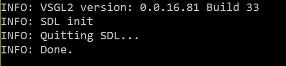
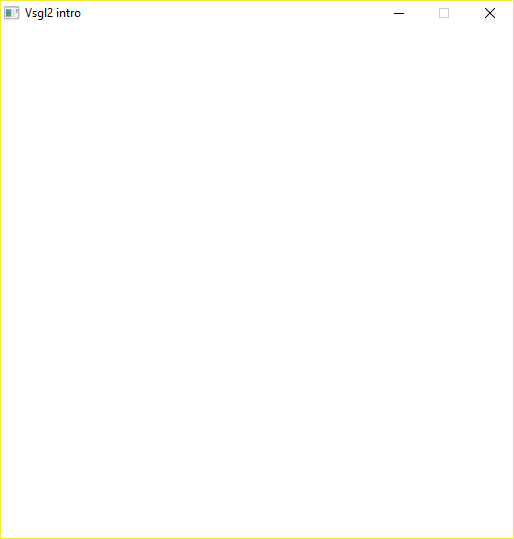

# Window creation
The very first thing to do to create a graphics program is to initialize the graphic using the `init()` function. This function manages various low-level settings about video, audio and image management. It also takes care of printing library version information as seen in this picture:



This information is visible only in the Debug build, because the Release build doesn't have a window to print the output.

As a second step, the `set_window()` function has to be called in order to open a window with the desidered dimensions.
The `set_window` function has these parameters

```c
set_window ( int width,
            int height,
            string title,
            [bool fullscreen]);
```

The fourth parameter is optional. If it is not present, the application will be windowed; otherwise, if it has a `true` or `1` value, the application will go fullscreen.

In this example, the window looks as it appears in the following picture:



Usually, after these two functions, there will be the program code, but in this case nothing is done, so the only thing to do is to take the window open, using the `wait_for_button_pressed()` function. This function stop the program waiting for the pression of any button. When the user will press any key, the program will call the `close()` function to clean up all the resources and to guarantee the correct termination.
