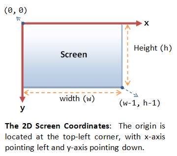

# Drawing lines
The library can be used to draw simple geometrical shapes, such as lines or points or rectangles.
The function to draw a line is `draw_line()` and it has 5 parameters, as seen below:

```c
draw_line ( int x1,
            int y1,
            int x2,
            int y2,
            Color c);
```

The first four parameters are the x,y coordinates of the line endpoints, where the fifth is the **color** of the line. This latter deserves a little bit of deepening, because computers manage information about colors in a different way that humans are used to.

## Colors

 Typically, people speaks about colors using names (e.g. red, yellow, green,...), but the way colors are stored inside a computer is different and require a special code to be managed. There are different methods for coding colors, the way used inside this library is the most common used in graphics and it requires three numbers to describe a single color. These three numbers are referred as *red*, *green* and *blue* channels and this encoding is usually known as **RGB** encoding. Each of these channels is an integer number between 0 and 255 and all the possible combinations are more than 16 millions.

 For example, the (255,0,0) combination is a pure red, where (0,255,0) is a pure green and (0,0,255) is a pure blue. White is (255,255,255) and black is (0,0,0). The function `Color()` is used to "create" a color inside this library, passing as parameters the three channels more another one, named **Alpha** channel.

 The *Alpha* channel is related to transparency, where a value of 255 means completely opaque and a value of 0 means completely transparent (actually invisible).

 ## Draw a line
 In this code a red line from the top-left corner of the screen to the bottom-right corner of the screen is drawn, with the following code:

 ```c
draw_line(  0,
            0,
            get_window_width(),
            get_window_height(),
            Color(255,0,0,255)
          );
 ```

The x,y coordinates of the bottom-right corner of the screen are both positive numbers as in the picture below:

  

In this example `get_window_width()` and `get_window_height()` are used to obtain the coordinates of the bottom-right corner of the screen. These two functions return the screen dimensions as set in the `set_window()` function.

## Updating the screen
Whenever a drawing or an image is put to the screen this does not produce any visible effect, unless the screen has been updated. This is related to the way graphics boards work and it can be thought as a canvas where the drawing takes place but it is shown only when the painter is satisfied from his work, calling the `update()` function. Without `update()` nothing is shown on the screen, so it is very important to check its presence when something goes wrong in an unexpected way.
