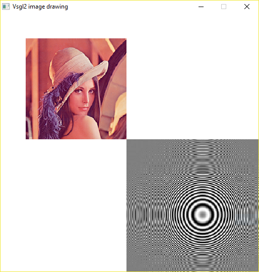

# Drawing images
In addition to drawing simple geometrical shapes, it is also possible to draw images. An image is loaded from a file, either BMP or PNG or JPG, and put on screen by simply calling this function:
```c
draw_image ( string image,
            int x,
            int y,
            int w,
            int h);
```

The first parameter is the file name. It can be expressed either using an absolute path or a relative path, as is shown in this example.
The second and the third parameter are the position of the image in terms of its left upper corner.
The last two parameters are the width and the height of the image: these dimensions are not necessarly the original dimensions of the image, but they can have any value, and the library will resize the image to fit the chosen ones.

The result of this code will be the following:



The first call to ```draw_image``` loads the Lena picture in (50,50) position and 200x200 dimension, where the second call loads the moire image with a little part outside the window.
If an image or a part of it is outside the window it is not a problem: in this case only the visible part will be rendered on the screen, while the remaining part will be ignored. As a consequence, if an image is completely outside the screen, it will be invisible.

It is interesting to note that the second image has some curious effects due to the resizing operation. The original image does not have such effects, called [Moiré pattern](https://en.wikipedia.org/wiki/Moir%C3%A9_pattern), but this image is chosen to stress this kind of artifact: when an image is resized, different sorts of artifacts can appear, so it is a good idea to resize the image using an image manipulation program such as [Gimp](https://www.gimp.org/) to obtain the desired result.

## Where is the right place to put the images?
Using a relative path, which is a good idea in most situations, one solution is to store the image in the program folder, i.e. where the executable is, or, to be more structured, inside an "images" directory.

As an example, with the latter solution the path would become "images/my_image.png".


## What happens if the image doesn't exist or it is not in the correct place?

Nothing. Rather than crashing the application, the library manages this situation by emitting a message to the console and the application will keep running without problems.
