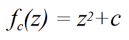
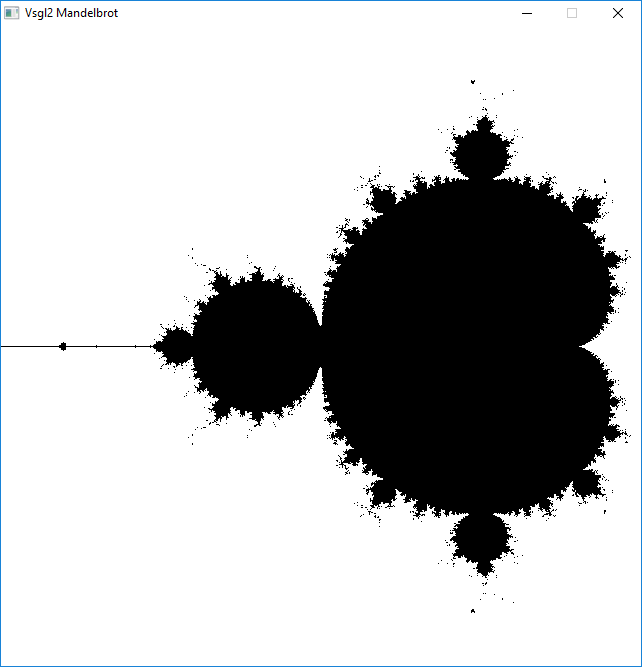
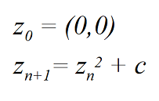

# Mandelbrot set
In this example the ```draw_point``` function is used to draw the Mandelbrot set (more information about the Mandelbrot set can be found on this [Wikipedia page](https://en.wikipedia.org/wiki/Mandelbrot_set)).

In this first example the figure is black and white, where black points are points where the function



does not diverge when iterated starting from z = 0.

The results will be the following



Since the function needs complex numbers, a structure is defined as follows (standard library complex could also be used):

```c
struct Complex{
    double real, imm;
};
```
and addition and multiplication are also defined to compute the function.
The function ```diverge``` checks if a complex number *C* diverges and this information is used to draw the point black or white. The evolution of a number *C* is computed using this recurrence:



It is simple to implement that formula with the following function:

```c
int diverge(Complex C)
{
  int i;
  Complex Z;
  Z.real = 0;
  Z.imm = 0;
  for (i = 0; i < MAX_ITERATIONS; i++)
  {
      if (mod(Z) > RADIUS)
          return 1;
      Z = sum(multiply(Z,Z),C);
  }
  return 0;
}
```
If the modulus (or magnitude) of Z becomes greater than RADIUS before MAX_ITERATIONS, the function will return 1, meaning that C diverges. Otherwise it will return 0, meaning that C does not diverge.

A simple formula is used to translate the coordinates from the screen coordinate system to the complex plane coordinates:

```c
Complex c;
c.real = i*X_RANGE/get_window_width() + X_BEGIN;
c.imm = j*Y_RANGE/get_window_height() + Y_BEGIN;
```            
