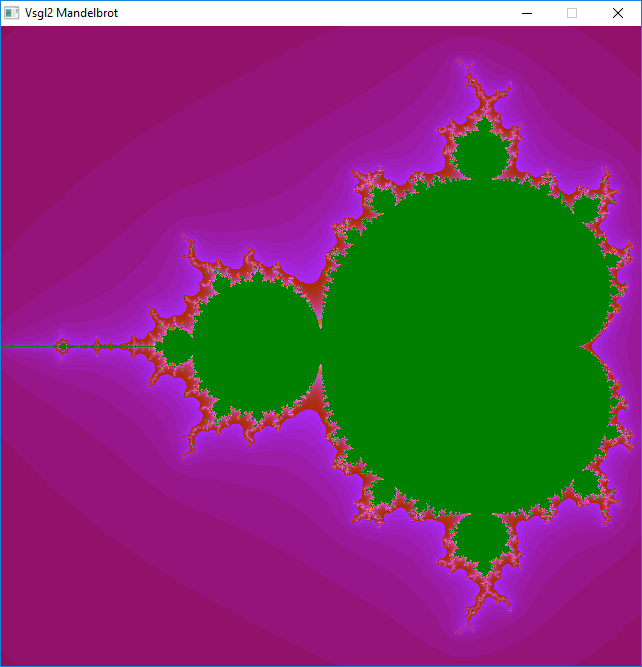

# Mandelbrot set with colors
This example extends the one about the Mandelbrot set adding colors to the image, obtaining the following result



The coloring is obtained changing the returned value from the ```diverge``` function: this time the number of iterations where Z becomes too large (greater than RADIUS) will be returned and this number will be turned into a color using the following formula:  
```c
int n = diverge(c);
draw_point(i,j,
          Color(128 + n*128/MAX_ITERATIONS ,
                n*128/MAX_ITERATIONS,
                n*768/MAX_ITERATIONS%256,
                255));
```
