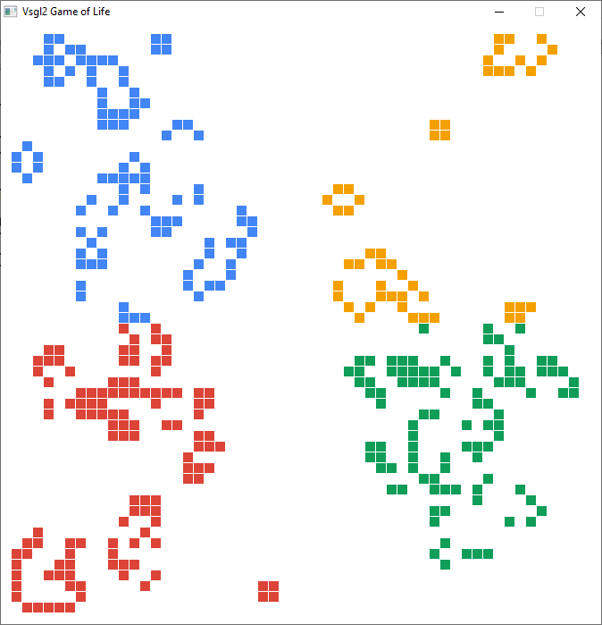
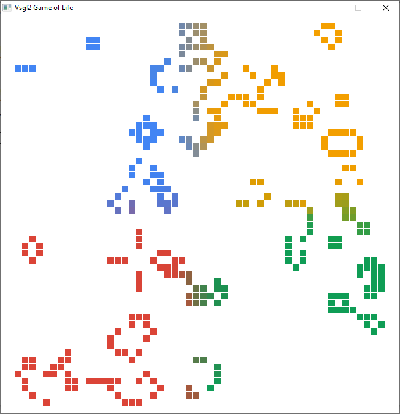

# Game of Life with colors
Only a little variation to the previous lesson, always the Game of Life, this time with colors. 

[](http://www.youtube.com/watch?v=eKYDIpUO78E "YouTube video on Game of Life with colors")

To achieve coloring, it has been added a matrix, where each cell represents a single Color. At the beginning, the color matrix is filled with 4 colors, each one at a different dial (top left = blue, top right = yellow, bottom left = red, bottom right = green), so all the cells belonging to the top left dial are blue, etc.

During the drawing phase, every live cell is colored using the color at the same position in the color matrix, obtaining this effect:



To add a touch of style, there are two different ways of coloring: the first one, showed in the above picture, where each cell has 

always the same color during all the animation; the second one, where colors are blended according to the colors of their neighbours, obtaining a more pleasant effect.



At first the program asks the user which ones of the two modes he/she prefers. Then the animation starts, and the only difference with the previous version of this program is in the ```blend``` function: if *BLENDING_ON* is ```true```, the function calculates the average value for each one of the R, G, B values and writes the calculated value inside the color matrix at position *r, c*.

```c
void blend (int m[][DIM], int r, int c)
{
    int R = 0, G = 0, B = 0, counter = 0;
    for (int i = r-1; i < r - 1 + 3; i++)
        for (int j = c-1; j < c - 1 + 3; j++)
            if (m[i][j])
            {
                R += colors[i][j].c.r;
                G += colors[i][j].c.g;
                B += colors[i][j].c.b;
                counter++;
            }
    colors[r][c] = Color(R/counter, G/counter, B/counter, 255);
}
```

As it can see, the average is calculated only considering the live cells, using the instruction ```if (m[i][j]){...}```.
