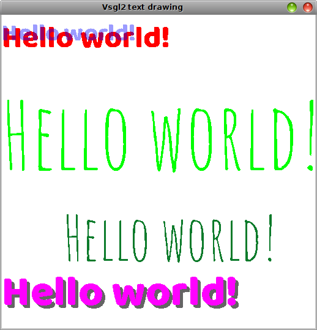

# TrueType fonts

The library contains a function to draw text with [TruetType Fonts (TTF)](https://en.wikipedia.org/wiki/TrueType): the text can be drawn at different sizes and different colors.



This function has the following signature:
```c
void draw_text(string font,
              int dim,
              string text,
              int x,
              int y,
              Color c);
```
where **font** is the name of the font used, **dim** is the dimension, **text** is the text to be displayed, **x** and **y** are the coordinates where the text will be placed and **c** is the color of the text.

The font can be any TTF file and it must be visible from the program, in the same way as an image must be (see the example about image drawing).

In this example some "Hello world!" are shown, each of them with different size and color and a different displacement. The fonts used in this example are [Amatic SC](https://fonts.google.com/specimen/Amatic+SC) and [Baloo](https://fonts.google.com/specimen/Baloo): both of them are from [Google fonts](https://fonts.google.com/) and they have a kind of license ([OpenFont License](http://scripts.sil.org/cms/scripts/page.php?site_id=nrsi&id=OFL_web)) that allows to use them inside their own projects.
