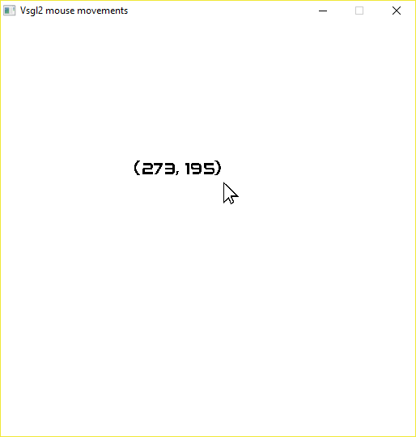

# Mouse movements

The VSGL2 library contains some functions to read the mouse state:
- ```get_mouse_x()``` and ```get_mouse_y()``` to read the mouse coordinates
- ```mouse_left_button_pressed()``` and ```mouse_right_button_pressed()``` to read the button status.

In this example the first two functions are used to read the mouse coordinates and display them on the screen.



Two other functions related to TrueType fonts are also used: ```text_width``` and ```text_height```. Their signature is:
```c
  text_width(
    string font,
    int dim,
    string text
  )
```
where **font** is the name of the font used, **dim** is the dimension, and **text** is the text to be displayed: these functions are useful to obtain the real dimension in pixels of the text to be displayed, because it depends on the font, dimension and text to be displayed. In this example, this information is used to show the mouse coordinates above the mouse position rather than below, using the following code:
```c
draw_text("audiowide.ttf",20,coordinates,
          x  - text_width("audiowide.ttf", 20 ,coordinates),
          y - text_height("audiowide.ttf", 20, coordinates),
          Color(0,0,0,255));
```

The *width* and the *height* of the text are subtracted from *x* and *y* to move the text above the mouse position.

The string **coordinates** is created using **sprintf** function in this way:
```c
  sprintf(coordinates,"(%3d, %3d)",x ,y );
```
where **x** and **y** values are refreshed at each cycle of the main loop:
```c
x = get_mouse_x();
y = get_mouse_y();
```

The *delay(2)* instruction is inserted only so that the CPU is not fully loaded without necessity.
