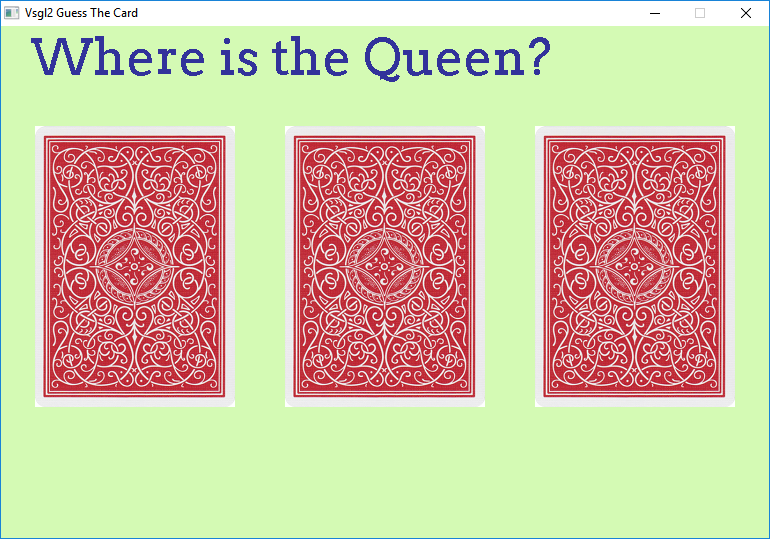
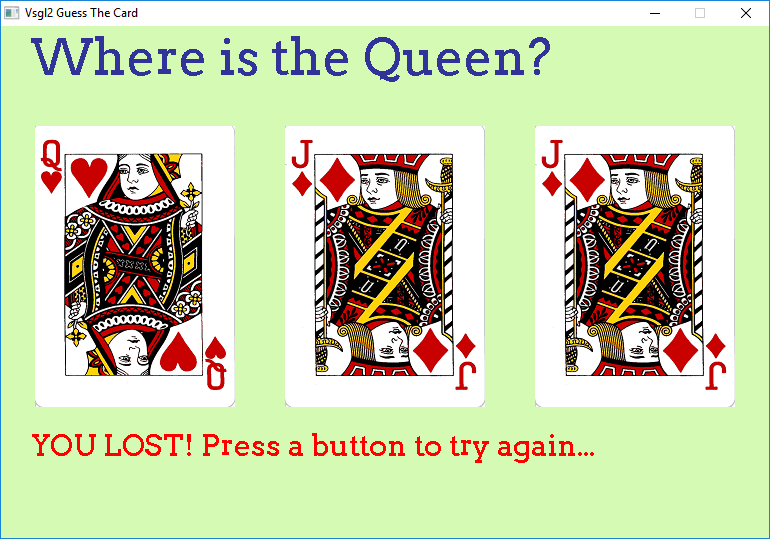

# Guess the card

This game shows an example on how to use the mouse input.

The user has to guess where is the Queen among the three cards on the screen clicking on them.



If you click on the correct position you win, otherwise you lose...



This program is built without using array nor string, to stay as simple as possible.

There are four functions to draw the card backs and the three different positions in which the Queen could be (as first, second or third position). At first the program chooses a position (1, 2 or 3) using the **rand()** function, then it enters in the main loop. Now it checks the left button pression of the mouse to check if it falls inside a card or not, using this simple function

```cpp
int choosen_card(int x, int y)
{
    if (x > start && x < start + card_width &&
        y > top_padding && y < top_padding + card_height)
        return 1;
    if (x > start + dim && x < start + card_width + dim &&
        y > top_padding && y < top_padding + card_height)
        return 2;
    if (x > start + dim*2&& x < start + card_width + dim*2 &&
        y > top_padding && y < top_padding + card_height)
        return 3;
    return 0;
}
```
The **x** and **y** parameters represent the mouse position and the **if** statements check if they are inside one of the three active areas (the cards), returning the number 1, 2 or 3 based on the mouse position. If the mouse is outside the cards, 0 returns.

Finally, the program checks the user choice against the computer one, showing the "You won" or "You lost" string according to the choice. 
