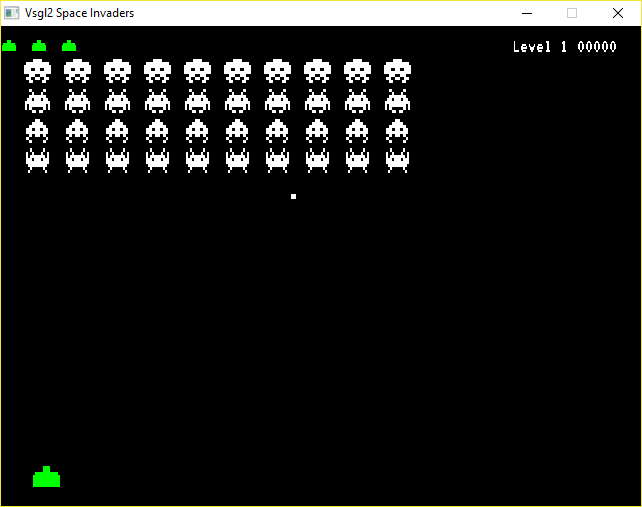

# Space Invaders
This example shows how to create a simple old-school game, heavily inspired by ["Space invaders"](https://en.wikipedia.org/wiki/Space_Invaders).

[](https://youtu.be/G4nEUZht29g)

To follow the explanation could be useful to watch the history of **git** on GitHub, where the features were added in more or less the same order as explained below.

The code is organized around *functions*, each of them devoted to a particular task.

## The splashscreen
As every professional game, this version of Space Invaders needs a nice splashscreen to introduce the player inside the game.  
All the code is inside the ```splashscreen()``` function: the most interesting part is about the **fade** effect, which is obtained through the following code:

```c
start = 3;
start_time = ms_time();
fade_time = ms_time();
while(start > 0 && !done())
{
    if (ms_time() - fade_time >= duration/(256*2))
    {
        fade += fade_dir;
        if (fade >= 255)
            fade_dir = -1;
        if (fade == 0)
        {
            fade = 0;
            fade_dir = 0;
        }
        fade_time = ms_time();
    }
    if (ms_time() - start_time > duration)
    {
        start--;
        sprintf(number,"%d",start);
        w = text_width(main_font,400,number);
        h = text_height(main_font,400,number);
        fade = 0;
        fade_dir = 1;
        start_time = ms_time();
    }
    draw_filled_rect(0,0,get_window_width(), get_window_height(),
                       Color(0,0,0,255));
    draw_text(main_font,400,number,(get_window_width()-w)/2,
                (get_window_height()-h)/2,
                Color(255,255,255,fade));
    //update the screen
    update();
}
```

The **start** variable is used to decide how many numbers will be shown in the countdown, 3 in this case. Inside the **while** loop, there are two checks:
- the first **if** checks the time using **ms_time** and increments (or decrements) the alpha value stored in the **fade** variable
- the second **if** checks if it is time to decrement the **start** variable: in that case it stores the new value inside the string **number**, which will be displayed each time, using the ```draw_text``` function.

## Alien spaceships
The enemies in this game are a fleet of alien spaceships: each spaceship has a number of attributes, for example the x,y coordinates, an image that represents it, if it is still active or not, so the most logical thing to do is to create a structure:

```c
struct Object{
    double x, y;
    int w,h;
    char name[30];
    int active;
};
```

The same structure will be used also to represent the user's tank.
A matrix will be used to maintain information on each spaceship and it will be used for every action  that involves the spaceships (drawing, shooting, etc.).

The result will be the following:



## Tank movements
To move the tank, the ```move_tank``` function checks if the *left arrow* key or the *right arrow* key are pressed, moving the tank accordingly.

```c
void move_tank()
{
    if (is_pressed(VSGL_LEFT))
        tank.x -= 1;
    if (is_pressed(VSGL_RIGHT))
        tank.x += 1;
}
```
Furthermore, the tank **x** coordinate is checked to avoid movements outside the screen.

## Updating spaceships movements
The fleet of spaceships moves from the top of the screen to the bottom, decrementing its distance from the bottom of the screen one row at a time, when it touches the left or right borders.

```c
if (spostamento_x < right_border && dir == 1
    || spostamento_x > SPACE && dir == -1)
      spostamento_x += dir * SPEED;
```
When a spaceship reach the same *y* position of the tank, the user lost a life and the fleet restarts from the top.

## Spaceships and tank shooting
During the game both the tank and the spaceships shoot each other.

The tank shoots when the user press the space key, but there can be only a bullet on fly at a time, so if the user presses the spacebar more times, nothing happens if a bullet is still on fly.

The fleet of alienships can shoot to the tank at random intervals, based on the followings:
- the function ```recharged``` checks if it is passed enough time to shoot another bullet
- a random column of the fleet's matrix is chosen using the ```which_ship_shooting```.
- the bullet will start from this column position, if there is at least one spaceship on this column.

## Collision detection
Collision detection is necessary to check if the tank or any of the ships have been striked by the opposite fire.
[Collision detection](https://en.wikipedia.org/wiki/Collision_detection) is a general technique with a lot of variants, in this case simple bounding boxes are used to represent every object, both ships than tank and bullets. The information about the bounding box for each object is stored inside the ```Object``` structure and the ```collide``` function is used to check if a collision between two objects has happened.

```c
bool collide(Object a, Object b)
{
    return !(a.y > b.y + b.h ||
             a.y + a.h < b.y ||
             a.x > b.x + b.w ||
             a.x + a.w < b.x);
}
```
The advantage of this technique is its simplicity and efficiency, as it can see in the code. On the other hand, if the objects have not a shape that can resemble a rectangle, it is not very precise.

Collisions are tested during each loop: the tank's bullet is checked against the first ship on each column and the aliens' bullets are checked against the tank. Every time a collision is detected, an alienship or the tank is destroyed.

## Sounds
To make the game more professional, a few sounds have been added:
- when the tank or a spaceship shoots, a sound is played using the ```play_sound``` function
- when the tank or a spaceship is hit, another sound is played using the ```play_sound``` function
- finally, a background music is played with the ```play_music``` function

## ...and finally...
To add another touches of realism, the following things have been added:
- a score system, the user gains points when he hit a spaceship
- a limited number of lives: at the beginning the user has 3 lives, each time he is hit he lost a life, but when he destroys a whole fleet he gains a bonus life. Each life is represented as a little tank on the top left corner of the screen
- simple levels system: each time the player destroy a fleet, he goes to the next level. At each level the spaceships move faster than the previous level
- a "best scores" system: the game can store a maximum of ten scores, so if you score better than these ten scores, you can add your name (only three letters, very old style) to the ranking
- it is possible to make as many matches as you want without restarting the program.  

So, start to learn through the code and have fun!
